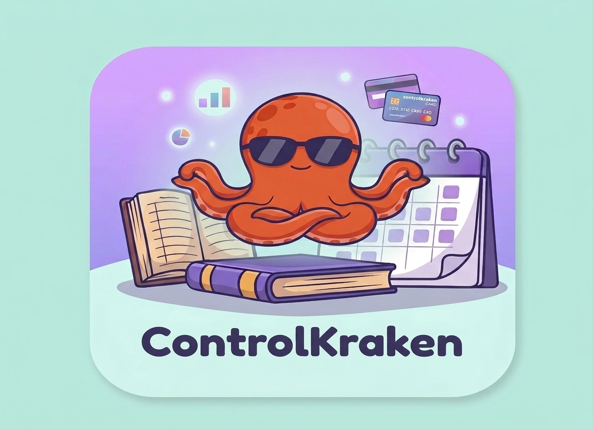

# ControlKraken



App personal hecha con Flet para llevar el control de todo: finanzas,
proyectos y, próximamente, memorias por voz y agenda.

## Correr la app

```bash
pip install -r requirements.txt
flet run main.py
```

Al abrir, la app aplica sola las migraciones pendientes de la base de datos.

## Estructura

```
main.py                 arranque y navegación
core/                   BD, CrudMixin, UI común, temas, inicio, archivos
modulos/<nombre>/       un folder por módulo (models/, views/, routes.py)
alembic/versions/       migraciones de la BD, en orden
data/                   adjuntos (fuera de git; respáldalo junto con la .db)
```

## Cambiar un modelo (migraciones)

1. Edita el modelo (por ejemplo, agrega un campo).
2. Genera la migración con el siguiente número:
   ```bash
   alembic revision --autogenerate --rev-id 0004 -m "agrega hora a recordatorio"
   ```
3. Revisa el archivo nuevo en `alembic/versions/`.
4. Aplícala con `alembic upgrade head`, o simplemente abre la app.

Comandos útiles:

| Comando | Para qué |
| --- | --- |
| `alembic current` | versión actual de la BD |
| `alembic history` | lista de migraciones |
| `alembic check` | ¿los modelos y la BD coinciden? |
| `alembic downgrade -1` | deshace la última |

Reglas: nunca edites una migración ya aplicada (crea otra) y respalda la `.db`
antes de una migración grande.

## Módulo nuevo

1. `modulos/<nombre>/__init__.py` con una clase que herede de `core.module.AppModule`.
2. Súmala a `MODULES` en `modulos/__init__.py`.
3. Si tiene modelos: agrégalos en `import_models()` de `core/database.py`
   y genera su migración.

## Versión

La versión vive en `core/__init__.py` (`APP_VERSION`) y los cambios en `CHANGELOG.md`.
